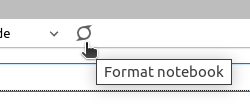

# cookiecutter-science

The template to start a new science project in Vizzuality.

## Setup a new project

First you need to have `cookiecutter` installed in your system.
Follow the instructions in the [installation docs](https://cookiecutter.readthedocs.io/en/2.0.2/installation.html).
I recommend going with the [pipx](https://pypa.github.io/pipx/) way
to deal with this kind programs.

With cookiecutter installed, run the following command to create a new project from a local copy of the template:

```bash
$ cookiecutter path/to/cookiecutter-science
```

or use directly the GitHub repo as a source for the template:

```bash
$ cookiecutter https://github.com/vizzTools/cookiecutter-science
```

## What's in the box?

The template will create a new project with the following structure:

```
├── README.md                   # the landing page for your project
│                                   Must contain all the importat information about the project.
├── data
│   ├── raw                     # a place for raw data.
│   └── processed               # a place for processed data.   
│  
├── notebooks                   # a place for jupyter notebooks (only "final" versions please).
│   └── _template.ipynb          # a template notebook with some useful structure.
│  
├── src                         # a place for python scripts.
│   └── __init__.py
│  
├── environment.yml             # conda/mamba environment file.
├── Dockerfile
├── docker-compose.yml
├── pyproject.toml              # python project file for global configuration.
├── LICENCE
├── .pre-commit-config.yaml     # pre-commit hooks configuration.
├── .gitignore
├── .editorconfig               # how many spaces and indentation your ide has to use.
└── .env.example                # example of .env file.
```

Simple.

### Conda environment

The template comes with a `conda` environment file.
I strongly recommend the use of [`mamba`](https://mamba.readthedocs.io/en/latest/)
to create and manage the environment. The environment has a basic set of packages that more or less
are the common ground of our projects. You can find the list of packages in the `environment.yml` file.

Probably you will need to add more packages to your environment according to your/project needs.
Once the project is created, you will have the instructions on how to create and update the environment in
the `README.md` file.

### Docker

The template comes with a `Dockerfile` and a `docker-compose.yml` file.
It allows running the project notebooks in a fully isolated environment.

The `docker-compose.yml` file is configured to mount the project folder and spin up
a jupyter server.

### Pre-commit hooks and code formatting

The template has a set of pre-commit hooks configured in the `.pre-commit-config.yaml` file.
It is a crucial part of the template. The hooks will run every time you commit changes to the repo.
This way we can ensure that the code is formatted and standardized according to the best practices.

To install pre-commit, there are multiple options:

- Installing the environment provided in the template locally, since it has pre-commit installed.
- Installing pre-commit in your system as globally available package or using [pipx](https://pypa.github.io/pipx/).

⚠**Please always install the hooks** when you start a new project with:

```shell
$ pre-commit install
```

This will autoformat the code and run the linters every time you commit changes to the repo.

To format the code manually, it is a **must** to use `black` formatter and `isort` to sort the imports.

#### Notebooks

In Jupyter Lab, the env has an installed extension to format the notebooks:



#### nbqa

To format and lint the notebooks outside of Jupyter Lab, the environment has the
[`nbqa`](https://nbqa.readthedocs.io/en/latest/index.html) package installed.
This allows you to run the formatters and linters for notebooks from the command line.
For example:

```shell
$ nbqa black notebooks/
```

will format all the notebooks in the `notebooks/` folder.

```shell
$ nbqa isort notebooks/
```

will sort the imports in all the notebooks in the `notebooks/` folder.

Finally, to lint the code in cells with `ruff`:

```shell
$ nbqa ruff notebooks/
```

#### Scripts and IDEs

If you work in Vscode, you can install the black formatter and the isort extension to format the code on save.
Same for pycharm.
If you don't use any of these IDEs, you can always run the formatters from the command line (inside the env):

```shell
$ black src/
```

```shell
$ isort src/
```

_Note: the notebook engine in Vscode and pycharm is a bit more fiddly to configure for formatting and linting.
Use the black and isort extensions available in the marketplace and check for notebook support or use `nbqa` from the
command line._

## Notebook styleguide and general guidelines

The template comes with a template notebook in the `notebooks/` folder called `_template.ipynb`. It has a simple
structure as a starting point for your notebooks.
Remember that the notebooks **are a way to communicate your work**, so it is important to keep them clean and tidy.
Here are some musts and guidelines to follow:

- Use markdown cells to explain what you are doing and why.
- Keep only the outputs of the cells that are important to understand the process (plots, result values, etc).
  **Avoid** any sort of **long outpust** that will clutter the revision of the notebook
  (whole dataframes, debug messages, gdal command outputs, etc).
- Group code and explanations in sections of related topics.
- Make a section of util functions or a separate file of utils and import it like `%run analysis_utils.ipynb`

If you need some inspiration, take a look at
the [Peter Norvig's pytudes notebooks](https://github.com/norvig/pytudes/tree/main/ipynb).
They are a great example of how to use notebooks in a clean and tidy way. For
example [this one](https://github.com/norvig/pytudes/blob/main/ipynb/Economics.ipynb).

